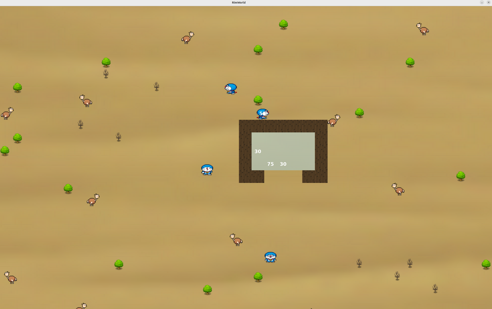

# RimWorld-like Game

This project is a RimWorld-like game implemented using SDL2. The game allows you to manage a colony, set storage areas, designate tree cutting zones, and create building blueprints. You can start a new game or continue from a saved game.



## Features

- **Start New Game**: Click the "Start" button to begin a new game.
- **Continue Game**: Click the "Continue" button to load the game from the `savegame.json` file in the current directory.
- **Map Navigation**: Use the WASD keys to move the map.
- **Set Storage Area**: Press the `1` key to set a storage area.
- **Set Tree Cutting Zone**: Press the `2` key to designate a tree cutting zone.
- **Set Building Blueprint**: Press the `3` key to set building blueprints.
- **No Operation**: Press the `4` key to perform no operation.

## Getting Started

### Prerequisites

- SDL2
- SDL2_image
- SDL2_ttf
- C++17 compatible compiler

### Building the Project

1. Clone the repository:
   ```sh
   git clone git@github.com:Cookiecoolkid/RimWorld.git
    ```
2. Change the directory:
    ```sh
    cd RimWorld
    ```
3. Build the project:
    ```sh
    make
    ```
4. Run the game:
    ```sh   
    ./RimWorld
    ```
5. To clean the project:
    ```sh
    make clean
    ```